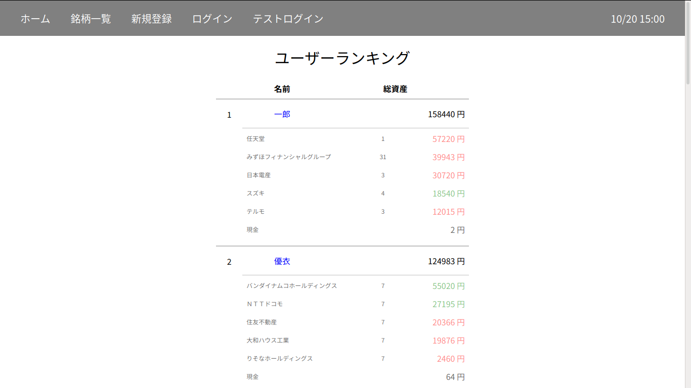

EC2 https://stock-app.net/

#### テストユーザーでログインできます

## 概要

1. 株式売買の体験ができます

2. １０万円を増やしてみましょう

3. 他のユーザーと競争しましょう

#### 株価は平日１６時頃更新されます。

## 環境

* AWS ECS(EC2) Nginx + Puma

* AWS RDS PostgreSQL

* Ruby 2.7.1

* Rails 6.0.3

* RSpec

* Slim (HTML)

#### gem 

* nokogiri ( スクレイピング )

* roo ( スプレッドシート )

* faker ( ユーザーネーム )

* ransack ( 検索フォーム )

* kaminari ( ページネーション )

#### ローカル環境

* Ubuntu

* Docker Compose

#### デプロイ

* Docker Hub -> AWS ECS

## 機能

* アカウント作成／削除

* メール認証 ( SendGrid )

* ログイン／ログアウト

* スクレイピングで株価取得

* 銘柄一覧表示／検索（ TOPIX100 ）

* 仮想的な株式売買

* ユーザーのランキング表示

* 独自ドメイン ( Route53 )

* SSL/TLS ( Let's Encrypt )

## コードの場所

* 株価更新
  - [lib/tasks/stock.rake](https://github.com/keisukeh1016/stock_app/blob/master/lib/tasks/stock.rake)

* デプロイ
  - [deploy-ecs.rb](https://github.com/keisukeh1016/stock_app/blob/master/deploy-ecs.rb)

## 他のデプロイ場所

* Heroku 
  - https://stock-ja.herokuapp.com/