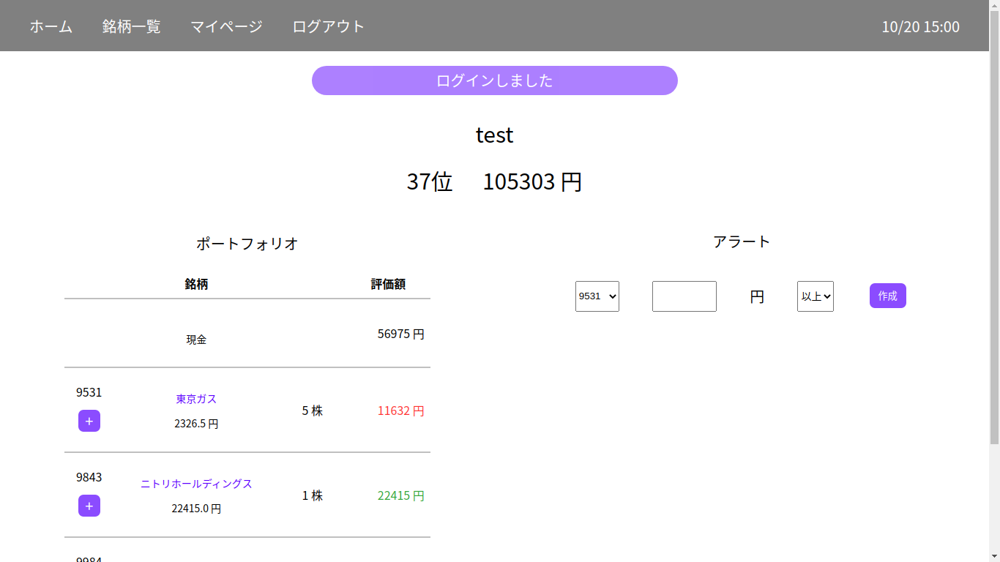
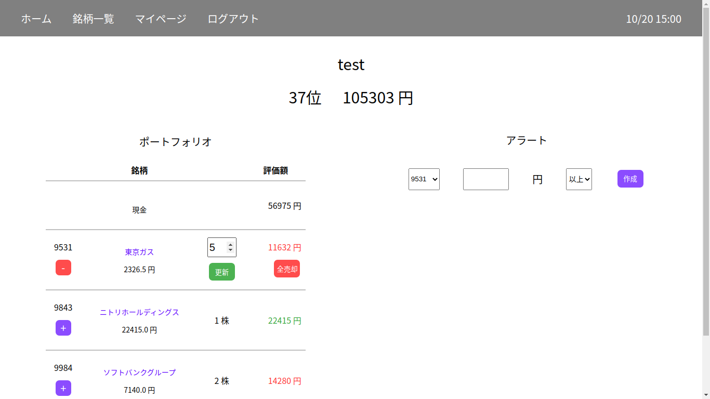
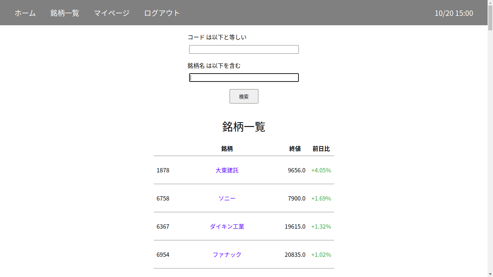
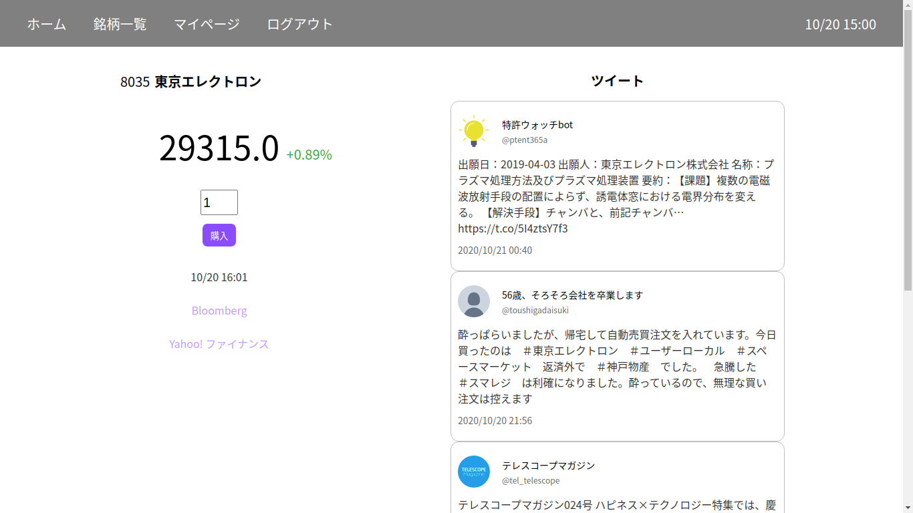

## 株式売買の体験ができます

- テストユーザーでログインできます
  

## 使い方

1. ログインすると、マイページに遷移します
   

2. ポートフォリオの欄に現在保有中の銘柄一覧が表示されています

3. 青色の＋ボタンを押すと、銘柄の売買画面が表示されます
   

4. 他の銘柄の検索もできます
   

5. 銘柄ページから新規購入できます
   

## 開発環境

- Ruby on Rails 6.0.3
- RSpec
- Heroku
- SendGrid
- Twitter Search API
